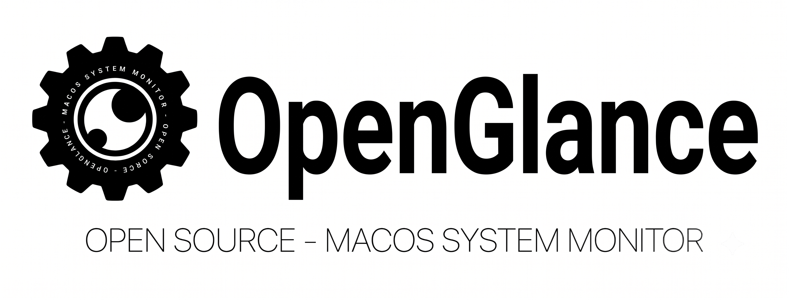
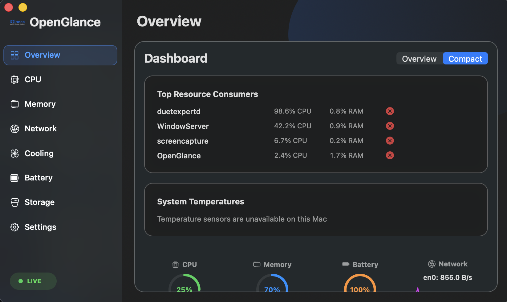

# OpenGlance

OpenGlance is an actively maintained fork of [iGlance](https://github.com/iglance/iGlance), a macOS system monitor for the menu bar. It keeps iGlance's GPLv3 license and contributor attribution while continuing development with a modernized interface and expanded dashboard.

Homepage: [Usama3627.github.io/OpenGlance](https://usama3627.github.io/OpenGlance)





## What's new in v2.2

- Native Apple Silicon compatibility.
- Redesigned macOS interface with a modern sidebar and glass-style content surfaces.
- New Dashboard with Overview and Compact modes.
- Live CPU, memory, battery, network, process, storage, uptime, and system information.
- Component-level dashboard updates to avoid full-page refresh flicker.
- Improved responsive dashboard layout for long CPU and GPU names.
- Updated project, app bundle, and executable branding: **OpenGlance**.

More monitoring, dashboard, and menu-bar features are planned.

## Features

- CPU utilization and temperature monitoring
- Memory, network, disk, battery, and fan monitoring
- Configurable menu-bar items
- Top resource-consumer dashboard
- Light and dark appearance support

## Requirements

- macOS 10.13 or later
- Apple Silicon and Intel Macs are supported

## Install

Download the latest macOS build from [GitHub Releases](https://github.com/Usama3627/OpenGlance/releases/latest), unzip it, and move **OpenGlance.app** to your Applications folder.

> Releases are currently unsigned, so macOS may ask you to confirm that you want to open the app.

## Publishing a release

Set the same version in `Version.txt` and the Xcode `MARKETING_VERSION`, then push a matching tag (for example, `v2.2.0`). GitHub Actions builds the universal app and attaches its ZIP and SHA-256 checksum to the GitHub Release.

## Build and run

1. Install dependencies:

   ```sh
   cd iGlance
   pod install
   ```

2. Build and run from the repository root:

   ```sh
   ./run.sh
   ```

Alternatively, open `iGlance/OpenGlance.xcworkspace` in Xcode and select the **OpenGlance** scheme.

## Fork and licensing

OpenGlance is a fork of iGlance. It remains licensed under the [GNU General Public License v3.0](LICENSE), the same license as the upstream project. Upstream authors and third-party library contributors retain their respective copyright notices and attributions.

## Contributing

Issues and contributions are welcome. Please preserve existing license headers and attribution when modifying upstream-derived code.

## Credits

OpenGlance builds on iGlance and its contributors, including the authors of:

- [SMCKit](https://github.com/beltex/SMCKit) and [SystemKit](https://github.com/beltex/SystemKit)
- [CocoaLumberjack](https://github.com/CocoaLumberjack/CocoaLumberjack)
- [AppMover](https://github.com/OskarGroth/AppMover)
- [LaunchAtLogin](https://github.com/sindresorhus/LaunchAtLogin)

## License

This software is published under the [GNU GPLv3](LICENSE).
